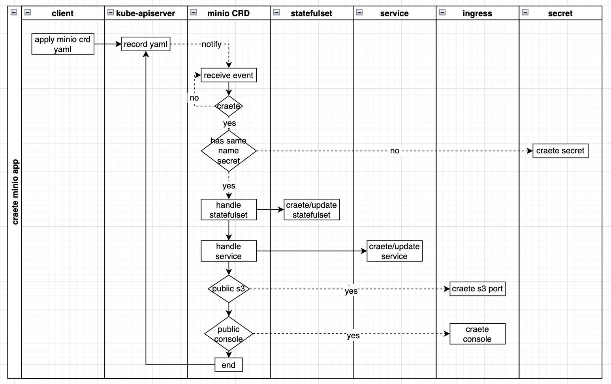
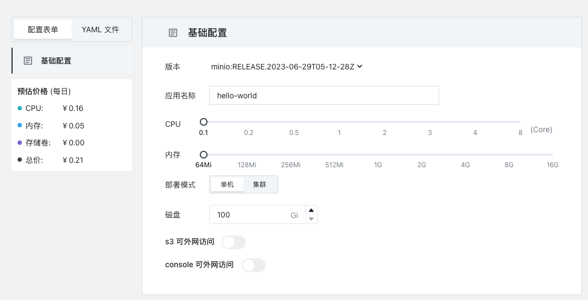
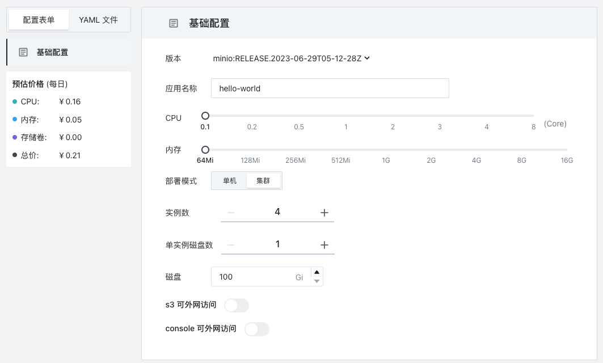

# minio app design

## process
### create
create flow chart:



1. client apply minio yaml
```yaml
apiVersion: minio.storage.sealos.io.sealos.io/v1
kind: Minio
metadata:
  labels:
    app.kubernetes.io/name: minio
  name: minio-sample
  namespace: user-namespace
spec:
  replicas: 4
  clusterVersionRef: minio/minio:RELEASE.2023-06-29T05-12-28Z
  ingressType: nginx
  consolePublic: true
  s3Public: true
  pvcNum: 32
  resoure:
    limits:
      cpu: "1"
      memory: 256Mi
    requests:
      cpu: "0.1"
      memory: "64Mi"
      storage: 100Gi
```
2. minio CRD receive event from kube-apiserver
3. Check for the same namespace+name secret, if not, create it first, then apply to crd yaml status, like
```yaml
apiVersion: minio.storage.sealos.io.sealos.io/v1
kind: Minio
metadata:
  labels:
    app.kubernetes.io/name: minio
  name: minio-sample
  namespace: user-namespace
spec:
 ...
status:
  secretName: minio-sample
```
4. Check the statefulset change it if it exists, and create it if it does not exist.**WARN: DON'T CHANGE pvcNUM & storage size.**   
yaml status changed(now, have not been submitted), like:
```yaml
apiVersion: minio.storage.sealos.io.sealos.io/v1
kind: Minio
metadata:
  labels:
    app.kubernetes.io/name: minio
  name: minio-sample
  namespace: user-namespace
spec:
 ...
status:
  availableReplicas: 4
  currentVersionRef: minio/minio:RELEASE.2023-06-29T05-12-28Z
```
5. Check the service change it if it exists, and create it if it. Expose s3 & console port.
6. If s3 or console is public, create a ingress for each.   
yaml status changed(now, have not been submitted), like:
```yaml
apiVersion: minio.storage.sealos.io.sealos.io/v1
kind: Minio
metadata:
  labels:
    app.kubernetes.io/name: minio
  name: minio-sample
  namespace: user-namespace
spec:
 ...
status:
  publicS3Domain: https://s3-minio-xxx.cloud.sealos.io
  PublicConsoleDomain: https://console-minio-xxx.cloud.sealos.io
```


## web consle
### create singleton app


### create cluster app

